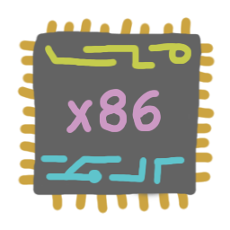

# Intro to x86 Assembly

**MICROSOFT MICROBE ASSEMBLER**

This is probably gonna be a pretty cool class. The professor is just immensely
chill. The only problem I see is maybe the "content questions". What if nobody
has any questions to answer? What if I have no questions to ask?

`mn`      |start       |end
----------|:----------:|:----------:
[`m1`](m1)|`2021.06.28`|`2021.07.04`
[`m2`](m2)|`2021.06.28`|`2021.07.04`
[`m3`](m3)|`2021.07.06`|`2021.07.12`
[`m4`](m4)|`2021.07.06`|`2021.07.12`
[`m5`](m5)|`2021.07.13`|`2021.07.19`
[`z0`](z0)|`2020.07.13`|`2021.07.19`
[`m6`](m6)|`2021.07.20`|`2021.07.26`
[`m7`](m7)|`2021.07.20`|`2021.07.26`
[`m8`](m8)|`2021.07.27`|`2021.08.02`
[`m9`](m9)|`2021.07.27`|`2021.08.02`
[`z1`](z1)|`2021.07.27`|`2021.08.06`

## resources

- [Irvine32 Docs](http://csc.csudh.edu/mmccullough/asm/help/)
